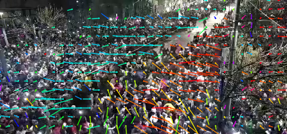
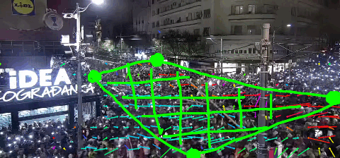
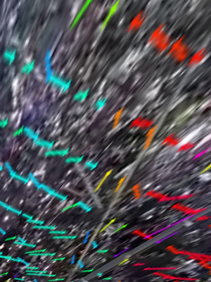
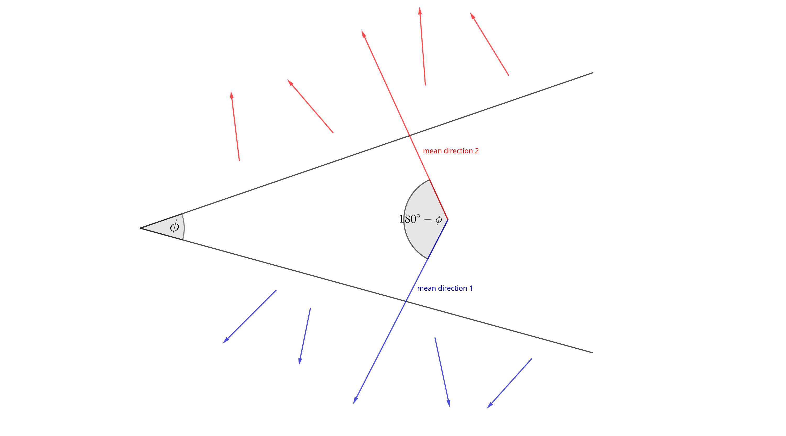
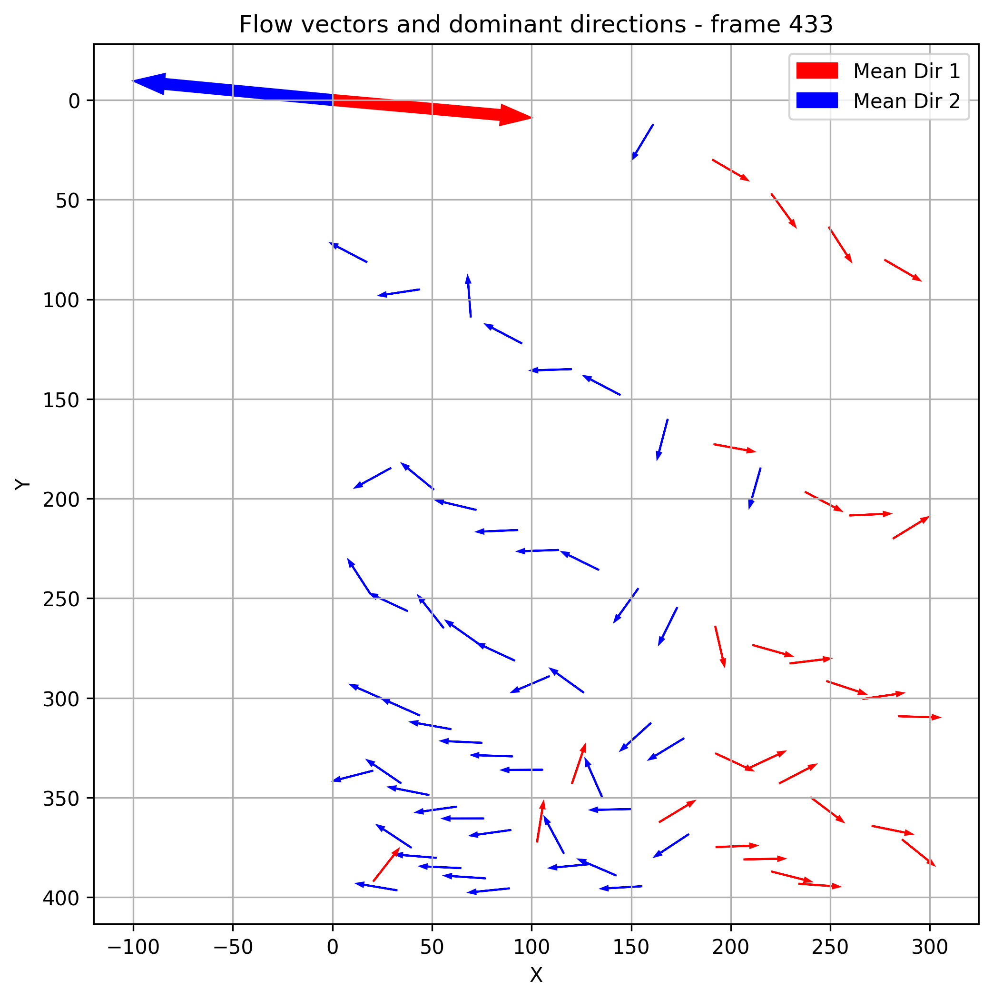
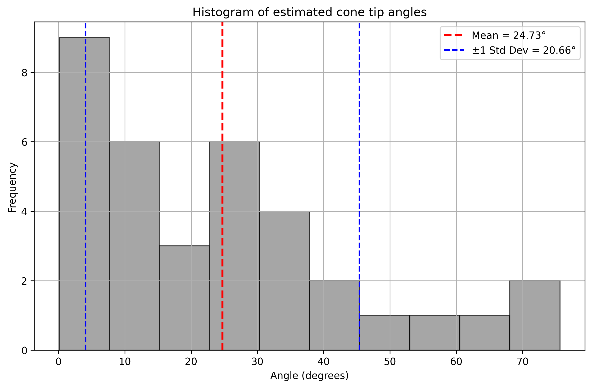
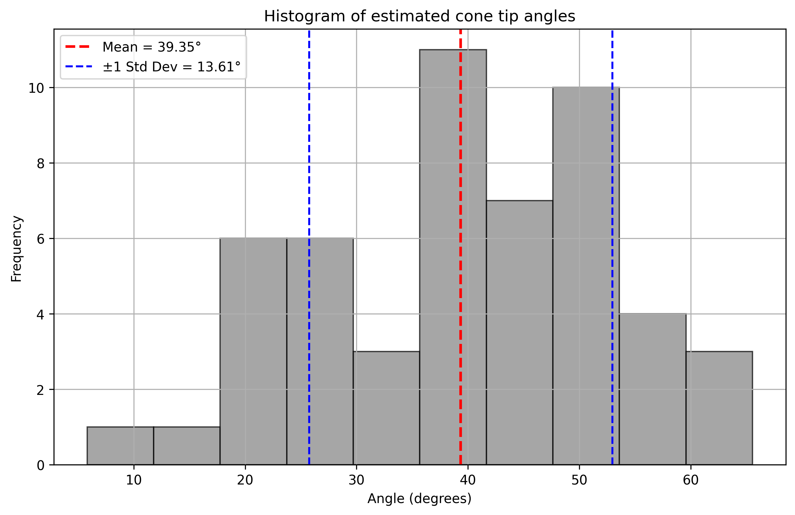

# Shock wave

We wish to estimate the **angle $\phi$** at the tip of the cone-shaped wave and the **velocity $u$** at which the people are moving in direction perpendicular to the cone-shaped wavefront.

<p align="center">
  <a name="fig1"></a>
  <br>
  <strong>Figure 1:</strong> The cone-shaped wavefront
</p>

## Available footage

Out of all the material from [@markusreuter](https://umap.openstreetmap.de/de/map/belgrade-sound-cannon-incident_86993#16/44.8083/20.4651) there are only two videos in which the propagation of the cone-shaped wave is clearly visible:

| File path             | Frames         | Description                                |    Source    |
|-----------------------|----------------|--------------------------------------------|------|
| [`./footage/idea.mp4`](./footage/idea.mp4)  | 420 to 460     | IDEA kod SKC-a, ka Beogradjanci | https://netzpolitik.org/wp-upload/2025/03/belgrade-cam20A.mp4
| [`./footage/cvetni.mp4`](./footage/cvetni.mp4) | 190 to 250 | *Looks like the location specified on the map is wrong* | https://netzpolitik.org/wp-upload/2025/03/belgrade-cam22A.mp4

## Overall strategy

We calculate [optical flow](https://docs.opencv.org/3.4/d4/dee/tutorial_optical_flow.html)
at each frame of the video and use it as a local estimate of the direction in which the crowd
is moving. [Figure 1](#fig1) shows color-coded trails indicating the direction of optical flow
at each pixel in the arbitrarily selected grid of points inside this image.

Next, in order to measure the angle $\phi$ and the velocity $u$ in the street plane, we obtain
the [bird's eye view](https://gist.github.com/anujonthemove/7b35b7c1e05f01dd11d74d94784c1e58).
We select the region of interest by specifying four points:

<p align="center">
  <a name="fig2"></a>
  <br>
  <strong>Figure 2:</strong> The ROI specified by four points
</p>

and use the [OpenCV library](https://docs.opencv.org/4.x/da/d54/group__imgproc__transform.html#gae66ba39ba2e47dd0750555c7e986ab85) to compute the transformation $H$ warping this region
to a bird's eye view image of fixed dimensions as on [Figure 3](#fig3).

<p align="center">
  <a name="fig3"></a>
  <br>
  <strong>Figure 3:</strong> The bird's eye view of the optical flow trails
</p>

This mapping $H$ is then used to transform the originally obtained optical flow vectors
to their coordinates in the bird's eye view, which are used as the basis of estimates for $\phi$
and $u$.

## Cone tip angle $\phi$

Under the assumption of this model, the lateral movement of the crowd is perpendicular to the
wavefront. [Figure 3](#fig3) (and the rest of the visualizations of the transformed optical flow trails in [here](./results/idea/transformed_vectors)) confirms that almost all optical flow vectors
belong to one of the two groups - the bluish vectors perpendicular to the left arm of the
cone and the orange-reddish vectors perpendicular to its right arm. Therefore, the angle 
between the mean directions of these two groups should be $\approx 180^{\circ} - \phi$,
meaning we can use it to estimate $\phi$ as shown on [Figure 4](#fig4).


<p align="center">
  <a name="fig4"></a>
  <br>
  <strong>Figure 4:</strong> An estimate for the cone tip angle
</p>

We then separate the flow vectors in each frame in 2 clusters using [k-means](https://scikit-learn.org/stable/modules/generated/sklearn.cluster.KMeans.html), and calculate
the mean direction of each cluster as well the angle between them.

<p align="center">
  <a name="fig5"></a>
  <br>
  <strong>Figure 5:</strong> A clustering of flow vectors in a single frame. The two thick arrows are the mean directions in the two clusters.
</p>

This is then repeated for each useful frame in the recording, giving the following results:

<p align="center">
  
  
</p>

<p align="center">
  <strong>Figure 6:</strong> Mean and standard deviation of the estimated cone tip angles across
  all frames. &nbsp;&nbsp; Left: <a href="./footage/idea.mp4">idea.mp4</a>,
  right: <a href="./footage/cvetni.mp4">cvetni.mp4</a>
</p>


## Velocity $u$

*try the magnitude of flow vectors?*

## Instructions

Install the Python packages and run:

```
python3 ./src/compute_flow_vectors_.py [path_to_video] [start_frame] [end_frame] [output_dir]
```

to get the optical flow vectors in ```[output_dir]/vectors```. Then transform them to bird's
eye view:

```
python3 ./src/transform.py [output_dir] [start_frame] [end_frame] [--bev_width BEV_WIDTH] [--bev_height BEV_HEIGHT]
```

where ```output_dir``` is the same directory that was provided to ```compute_flow_vectors.py```, and ```bev_width``` and ```bev_height``` are the desired width and height of the
bird's eye view image. This saves the transformed flow vectors in ```[output_dir]/transformed_vectors```. Finally, use these flow vectors to estimate quantities using:

```
python3 ./src/angle/cluster_directions.py [output_dir] [start_frame] [end_frame]
```

where ```[output_dir]``` is the same as in the previous two commands.